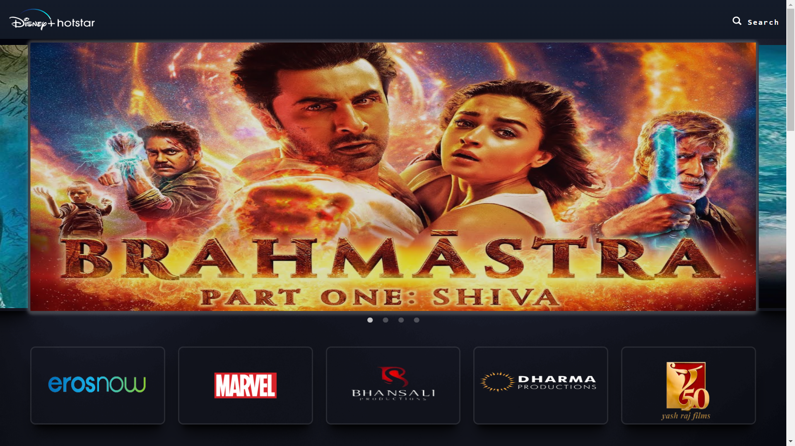
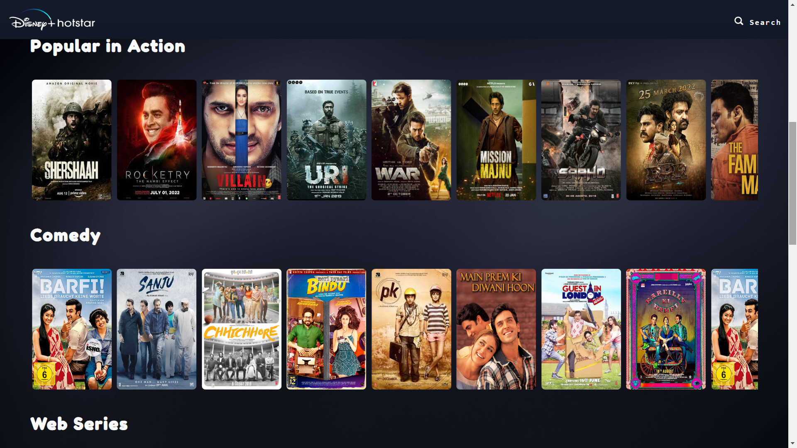
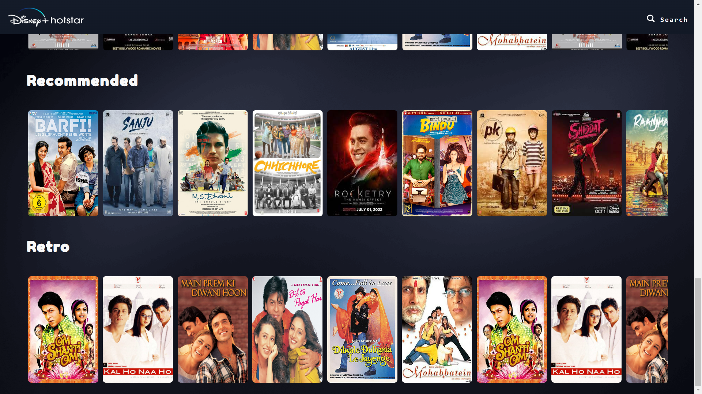
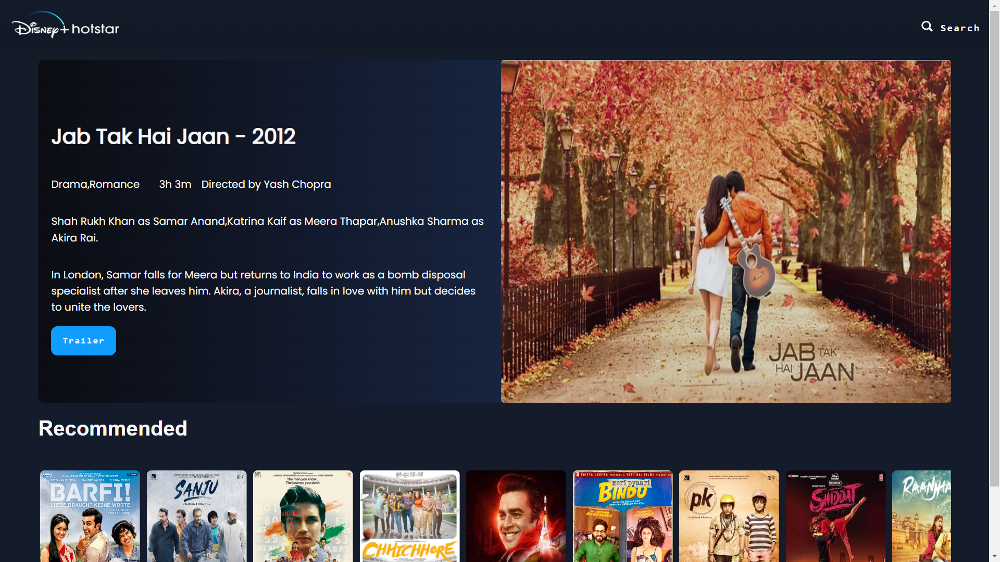
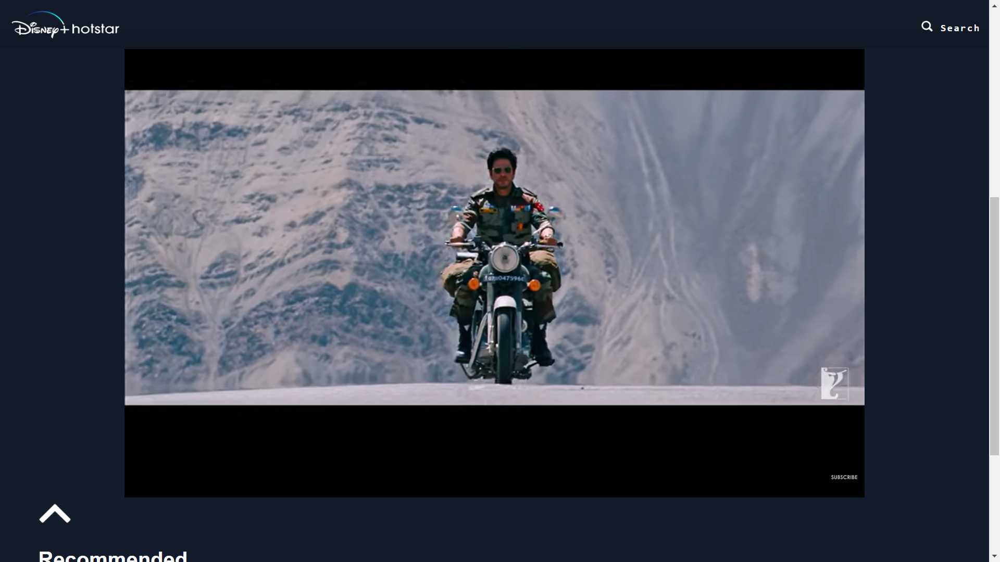
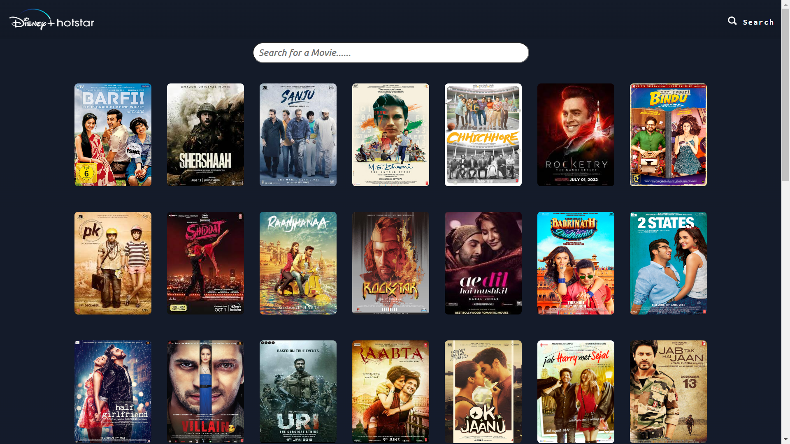

# Hotstar_Clone

### Live On

https://hotstar-clone-kk.onrender.com/

#### Demo Video

https://youtu.be/1wUAPbNShp0

## Authors

- [@ikarthik21](https://github.com/ikarthik21)

## Project Overview

This project is a HotStar clone. I built this with React.js. I used my own JSON API to fetch the movies. I used the YouTube Data API to get movie trailers.

[@movieAPI](https://github.com/ikarthik21/movieAPI)

## Run Locally

Clone the project

```bash
  git clone https://github.com/ikarthik21/Restobay.io.git
```

Install dependencies

```bash
  npm install
```

Start the server

```bash
  npm run Start
```

## Screenshots







